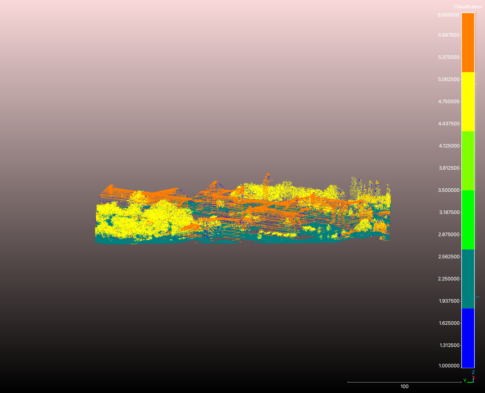
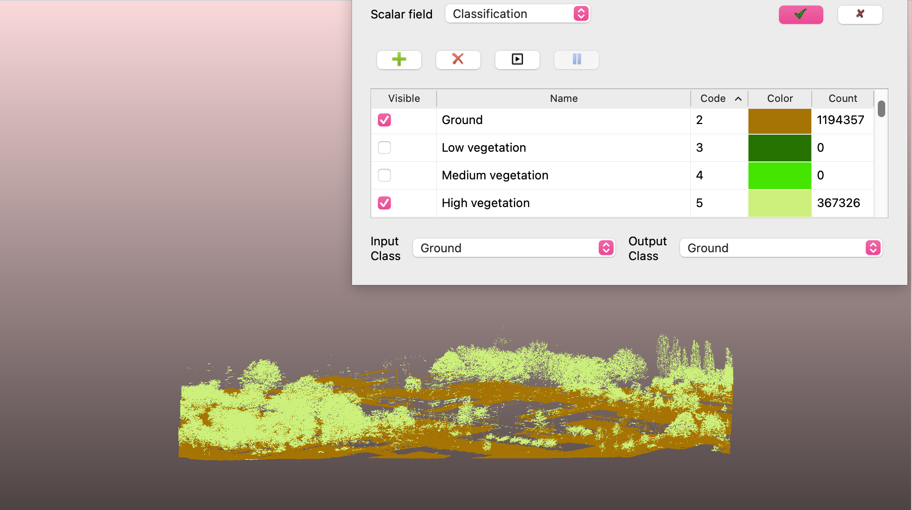

# Automatic Classification of Point Cloud
Affiliated with *Delft University of Technology*


## Contributors
* **Chaeyeon Moon**
* **Belina Aileen** 
* **Jaime Vergara** 
* **Niranjan Pradeep** 

<table>
  <tr>
    <td align="center">
      <br>
      <b>invalid self-intersecting..</b>
    </td>
    <td align="center">
      <br>
      <b>invalid 3D geom, non-watertight...</b>
    </td>
  </tr>
</table>

## Brief Introduction
This pipeline automatically transforms raw, unclassified 3D Airborne LiDAR datasets (`.laz`) into semantically labeled point clouds. This is done by analyzing geometric characteristics, point density variations, and local structural shapes, the system is then able to isolate and classify features into three categories:

1. **Ground Filtering (Class 2):** bare-earth terrain is isolated via Cloth Simulation Filter (CSF), which mathematically simulates an artificial cloth dropping upside down onto an inverted point cloud. The cloth rests smoothly on the topography while bridging over structures and vegetation. A secondary **Delaunay Triangulation (TIN)** model refines the results to remove lingering building foundations.
2. **High Vegetation Classification (Class 5):** Extracts trees and dense canopy elements using Principal Component Analysis (PCA). By measuring local point distributions within a neighborhood $k$-d tree, the algorithm differentiates organic, volumetric clusters from flat surfaces by tracking geometric properties known as **Planarity** and **Sphericity**, alongside multi-return laser filters.
3. **Building Detection (Class 6):** Identifies man-made structures by utilizing Singular Value Decomposition (SVD) to calculate local surface variation. The data is split into distinct horizontal roofs and vertical facades to eliminate airborne scanning bias. The pipeline then applies RANSAC plane-fitting to extract clean structural surfaces, followed by DBSCAN clustering to separate individual properties and filter out noise.

## Project Directory Structure

```text
.
├── README.md                      
├── code/                          
│   ├── main.py            
│   ├── preprocess.py             
│   ├── ground_classification.py   
│   ├── tree_classification.py     
│   └── building_classification.py
└── data/                         
    ├── out.laz                    
    └── dtm.tiff                   
    
## Instructions to Run the Code

#### 1) Download the following source codes from the `/code` directory

* `main.py` : The main entry point for the program.
* `preprocess.py` : Handles initial cleaning and preprocessing of the input file.
* `ground_classification.py` : Specifically classifies ground points (utilizing the CSF algorithm).
* `tree_classification.py` : Identifies and classifies vegetation points.
* `building_classification.py` : Detects and classifies building structures using RANSAC.

#### 2) Install the following libraries

* `laspy`
* `startinpy`
* `numpy`
* `scipy`
* `scikit-learn`
* `rasterio`
* `pyproj`
* `rerun`
* `logging`
* `os`
* `sys`
* `argparse`
* `time`

#### 3) Use the command line with the following syntax:

```bash
python geo1015_hw03.py inputfile.laz
```
* If user would like to modify arguments:
```bash
python geo1015_hw03.py inputfile.laz --csf_r 3 --csf_it 500 
```

**Modifiable Arguments:**

* `inputfile`: Input LiDAR data 
* `--csf_r`: Cloth resolution for the ground extraction
* `--csf_dT`: Time step for the external force application for the CSF
* `--csf_it`: Maximum number of iterations for the CSF
* `--csf_e`: Distance threshold for ground classification
* `--csf_zmax`: Height variation threshold to stop the CSF iterations


## Expected input format
Input file should be a **LAZ** file.

## Disclaimer
This repository contains an independently uploaded version from a collaborative academic assignment. However, course-specific materials and submission-related information have been removed for privacy while preserving contributor attribution.
